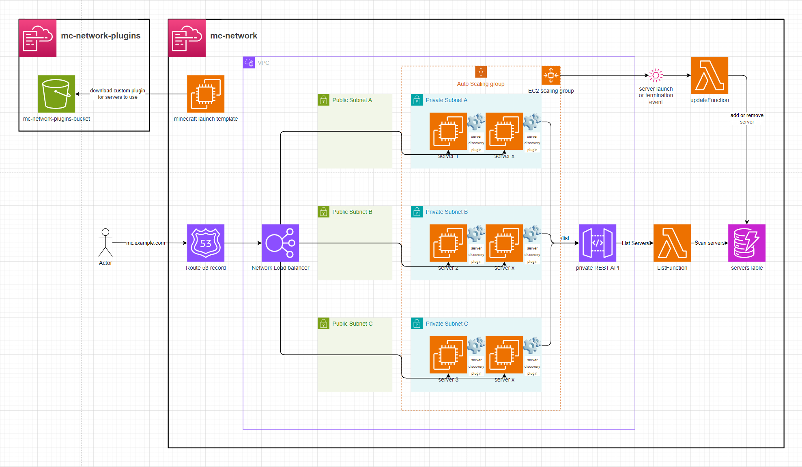

# AWS-EC2-minecraft-server-mesh

This setup launches **x EC2 instances**, each running a **Minecraft server**. A **custom Bungee plugin** connects all the servers, forming a **mesh network** that allows players to move between them seamlessly using the `/server <EC2 instance name>` command in Minecraft chat.

# Setup

See `.gitlab-ci.yml` for automated deployment.

1. **Deploy** the `plugin-template.yaml` CloudFormation stack.
2. **Build** the `BungeeServerList` Bungee plugin and upload it to the stack's S3 bucket:
   - Package the plugin using `mvn`, e.g. `mvn clean package`
   - Upload the resulting JAR file (in `target/`) to the S3 bucket created by the stack.
3. **Deploy** the `template.yaml` stack:
   - Provide the plugin's S3 path via the `pluginDirectory` CloudFormation parameter.
   - Configure the number of EC2 instances via the `scalingGroupDesiredSize` parameter.
   - Optionally, configure a domain on the Network Load Balancer in front of the Minecraft server mesh.

   ### a. Setup *without* a domain:
   - Leave `hostedZoneId`, `domainName`, and `subDomainName` **empty**. The stack will not create a Route53 record.

   ### b. Setup *with* a domain:
   - Provide values for `hostedZoneId`, `domainName`, and `subDomainName`. This will create a Route53 record in front of the Network Load Balancer.

# Minecraft Server Proxy

This setup leverages **BungeeCord** with a **custom Java plugin** that enables dynamic server discovery, live reloading of proxy target lists, and smooth player session transfers between servers in the mesh.

This is how the plugin displays the list of proxy targets to the players
